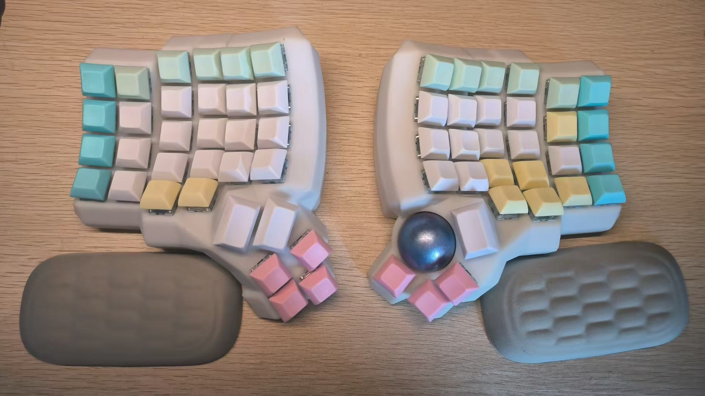

# UniqueDing Keyboard

## charybdis 5x6 with trackball

- Module use by dactyl_manuform_r_track

* Firmware use by zmk

* Board: nano_nice_v2

- trackball use by PMW3360

## reference

- [https://github.com/Schievel1/dactyl_manuform_r_track](https://github.com/Schievel1/dactyl_manuform_r_track)

* [https://zmk.dev/](https://zmk.dev)

* [https://github.com/DoctorWangWang/charybdis-cirque-nano-zmk-config](https://github.com/DoctorWangWang/charybdis-cirque-nano-zmk-config)
