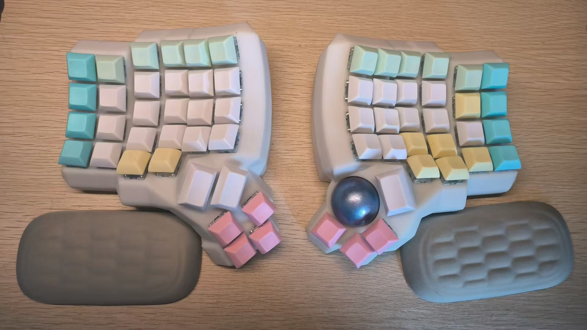
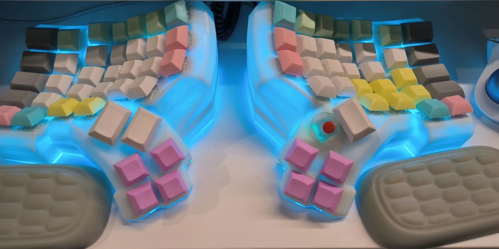

# UniqueDing Keyboard

## charybdis 5x6 with trackball

> branch charybdis_5x6_trackball

- Module use by dactyl_manuform_r_track

* Firmware use by zmk

* Board: nano_nice_v2

- trackball use by PMW3360

## dactyl manuform 5x7 with trackpoint and rgblight

> branch dactyl_5x7_trackpoint
