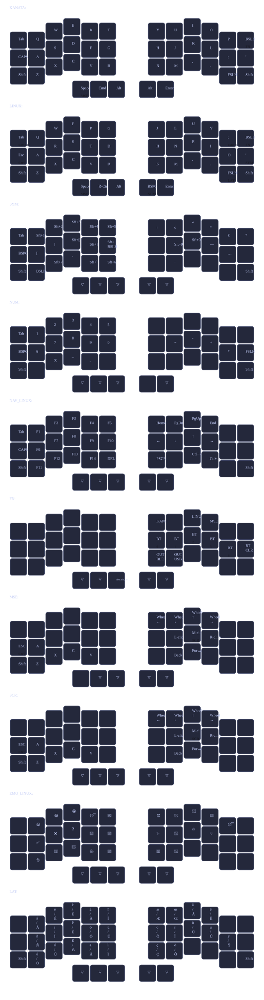

# Charybdis：Kanata 与原生 Colemak 固件模式

此分支基于 HeeTuic `36_charybdis_left_trackball`（`af73431dfe32f036ad51f24dd93eacb3df8369b5`），保留右侧 central、PMW3610 和 Studio 硬件设置。键位按用户提供的当前 Kanata 配置迁移。Unicode 依赖固定为 `urob/zmk-unicode` v0.3 对应提交 `3e8ca744e5c3b6f430b3713f3e45b806ce89be7b`；ZMK v0.3 与 PMW3610 driver 引用不变。

## 键位图

下图展示当前固件的全部 13 个图层：

## 图层与切换

固件共有 13 个有序图层，并非仅有三个图层：KANATA=0、MACOS=1、LINUX=2 为完整的基底；SYM=3、NUM=4、NAV_MAC=5、NAV_LINUX=6、FN=7、MSE=8、SCR=9、EMO_MAC=10、EMO_LINUX=11、LAT=12 为功能/平台子层。开机默认 KANATA；不会根据主机操作系统自动选择模式，也不会将选择持久化。

- KANATA 是普通 QWERTY，唯一的基底双功能键是右上角反斜杠：轻点 `\`，按住进入 FN。Caps、Tab、Shift、引号、空格和实际 RAlt 都是普通键。
- MACOS 和 LINUX 使用标准 Colemak（不是 Colemak-DH）。它们保留 Caps→Esc/Ctrl、Tab/NAV、分号/EMO、引号/SYM、斜杠/LAT 以及反斜杠/FN 的双功能行为。两种模式有各自的 NAV 与 EMO 子层。
- 在按住 FN 时，右手上排按物理左至右前三个键（主键索引 6、7、8）依次选择 KANATA、MACOS、LINUX；第四个键（索引 9）是 momentary MSE 入口。模式选择宏先更新 Unicode 模式，再切换基底层，避免键位模式与 Unicode 输出模式脱节。MSE 中按住中键进入 SCR 滚动层；先释放中键退出 SCR，再释放 FN 层中的 MSE 键。

## 拇指键

拇指顺序按每只手内部反转，左右手分组和物理矩阵不互换。物理左手从左至右：KANATA 为 Space、LGUI（Command/Super）、LAlt（macOS Option）；MACOS/LINUX 为 Space/MSE、LGUI（Command/Super）、LAlt（macOS Option）。物理右手从左至右：KANATA 为实际 RAlt、Enter；MACOS/LINUX 为 Backspace/NUM、Enter。MACOS/LINUX 的 FN 层 Studio 解锁键随左手 LAlt 移至第三个左拇指位，其余功能层拇指保持透明。三种基底均完整显式绑定，不依赖图层继承。两个原生模式的 MSE/Space、NUM/Backspace tap-hold 为 200 ms；层 tap-hold、Caps Esc/Ctrl、NUM 的 tmux hold-tap 也维持 200 ms。ZMK 的边界重按/打断时序可能与 Kanata 不完全一致，可按实际手感调节。

## 平台输出与主机要求

MACOS 的 NAV 截图键发送 Command+Shift+4；LINUX 对应键发送 PrintScreen。SYM 与 LAT 使用共享 Unicode 图层，LAT 提供大小写字符并保留左右 Shift 键。EMO_MAC 使用 macOS Unicode Hex Input；EMO_LINUX 使用 Linux Unicode 输入行为发送相同的字符码点，包括补充平面字符。

- **macOS：**使用前需在系统输入源中启用 **Unicode Hex Input**。补充平面 emoji 通过显式 UTF-16 surrogate 十六进制宏输入。协议依据为 QMK `7a1bbf37c5c07da4ea0a162bb139083a46ef40a1` 的 [`unicode.c`（247–270 行）](https://github.com/qmk/qmk_firmware/blob/7a1bbf37c5c07da4ea0a162bb139083a46ef40a1/quantum/unicode/unicode.c)。
- **Linux：**需使用配置好的 Fcitx5 Unicode 插件；通常通过 Ctrl+Shift+U 输入码点并以空格确认。具体应用兼容性取决于桌面输入法和应用程序。
- **Kanata：**如保留主机上的 Kanata 服务，仅让它对键盘应用于 KANATA 模式。切换到 MACOS/LINUX 原生布局前，须对该设备绕过/停用 Kanata 的重复改键。固件没有修改主机设置，也不保证设备过滤行为。
- Windows 原生 Unicode 路径不在本配置的支持或验证范围内；不能据此宣称其它操作系统兼容。

## 验证状态与实机测试

实现期间已进行本地静态键位、hold-tap、Unicode、层切换及指针层配置核对；这些检查不等同于固件构建或运行验证。当前没有可用的 west/Zephyr SDK，固件尚未构建，键盘与主机运行时行为也未实测。

刷写后建议验证全部六种模式转换（任意基底到其余两种再返回）、切换后释放 FN、FN→MSE→SCR 的进入/释放顺序、模式切换后再输出 Unicode、macOS/LINUX 截图、LAT 大小写、emoji、主机输入法配置。当前没有固件体积或构建成功的证据。
